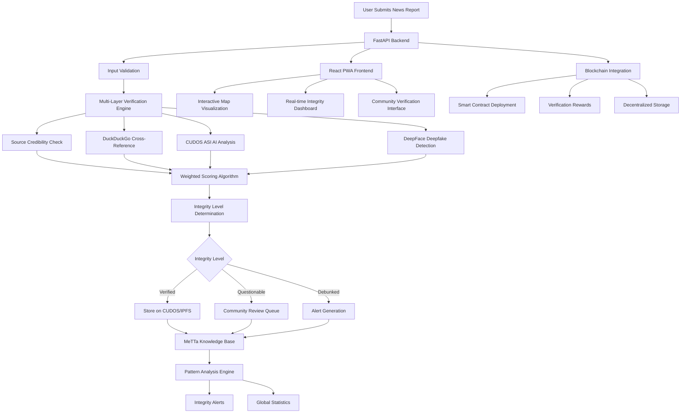

# Decentralized News Integrity Platform

Decentralized News Integrity Platform is a comprehensive solution for community-driven news verification and media integrity monitoring that utilizes CUDOS for the distributed AI Inference , duckduckgo does more search queries on the news report, tensorflow and deepface are used to identify deepfake contents and then metta verifies and provides the scoring. It integrates with blockchain for decentralized storage and verification rewards.

## System Architecture



## Algorithm Process

### Multi-Layer Verification Pipeline

The system employs a sophisticated 4-layer verification algorithm that combines traditional fact-checking with cutting-edge AI technologies:

#### 1. **Source Credibility Assessment (30% weight)**
- **Technology**: CUDOS ASI Cloud (distributed AI inference)
- **Process**: Analyzes historical accuracy and reliability of news sources using machine learning models
- **Purpose**: Evaluates editorial standards, fact-checking practices, and potential biases through comprehensive source analysis
- **Output**: Credibility score (0-1) based on source reputation and performance history

#### 2. **Cross-Reference Verification (20% weight)**
- **Technology**: DuckDuckGo Search API (privacy-focused web search)
- **Process**: Searches for corroborating reports across reputable news sites without commercial bias
- **Purpose**: Analyzes temporal consistency, source diversity, and cross-validation of claims
- **Output**: Boolean confirmation of corroboration found across multiple independent sources

#### 3. **AI Content Analysis (30% weight)**
- **Technology**: CUDOS ASI Cloud (ASIC-accelerated AI processing)
- **Process**: Leverages distributed computing for deep content understanding and pattern recognition
- **Purpose**: Detects factual accuracy indicators, misinformation patterns, and linguistic coherence
- **Output**: Confidence scoring for automated content assessment and semantic analysis

#### 4. **Media Integrity Check (20% weight)**
- **Technology**: DeepFace (facial recognition) + TensorFlow/OpenCV (computer vision)
- **Process**: Analyzes uploaded images/videos for manipulation signs using neural networks
- **Purpose**: Detects deepfakes, altered content, and metadata tampering indicators
- **Output**: Authenticity probability score with blockchain timestamp verification for immutability

### MeTTa Knowledge Integration
- **Technology**: MeTTa (Meta Type Theory symbolic AI)
- **Process**: Creates structured knowledge atoms and enables logical reasoning about content relationships
- **Purpose**: Builds self-learning knowledge base for pattern recognition across news domains
- **Integration**: Processes verification results to improve future accuracy and detect sophisticated disinformation campaigns

### Integrity Scoring Algorithm
### Integrity Level Determination

- **Verified (0.8-1.0)**: High-confidence authentic content, stored on IPFS
- **Pending (0.6-0.8)**: Requires community review
- **Questionable (0.3-0.6)**: Potential misinformation, flagged for monitoring
- **Debunked (0.0-0.3)**: Likely false information, triggers alerts

## Innovation Highlights

### 1. **MeTTa Knowledge Integration**
- First system to integrate MeTTa (Meta Type Theory) for symbolic AI reasoning
- Knowledge atoms enable pattern recognition across news domains
- Self-learning system that improves verification accuracy over time

### 2. **CUDOS ASIC Acceleration**
- Utilizes CUDOS blockchain's ASIC-powered AI inference
- Distributed computing for scalable content analysis
- Cost-effective AI processing through blockchain incentives

### 3. **Multi-Modal Verification**
- Combines text analysis, image forensics, and source credibility
- Cross-platform verification spanning web, social media, and traditional news
- Temporal analysis for detecting coordinated disinformation campaigns

### 4. **Community-Driven Governance**
- DAO-based platform governance
- Tokenized incentives for accurate reporting and verification
- Decentralized reputation system for community members

### 5. **Real-Time Integrity Monitoring**
- Live pattern detection and alert generation
- Geographic visualization of misinformation spread
- Predictive analytics for emerging disinformation trends

## Technology Stack

### Backend Infrastructure
- **Framework**: FastAPI (Python async web framework)
- **Database**: SQLAlchemy with SQLite/PostgreSQL support
- **AI/ML**:
  - MeTTa programming language (via hyperon)
  - CUDOS ASI Cloud for distributed AI inference
  - DeepFace for facial recognition and deepfake detection
  - TensorFlow/OpenCV for computer vision
  - DuckDuckGo Search API for cross-referencing

### Frontend Technologies
- **Framework**: React 19 with Vite build system
- **UI/UX**: Tailwind CSS for styling, Framer Motion for animations
- **Mapping**: Leaflet.js with React-Leaflet for interactive maps
- **Data Visualization**: D3.js for advanced charts and graphs
- **State Management**: TanStack Query for server state management
- **PWA**: Service workers for offline functionality

### Blockchain & Decentralized Storage
- **Blockchain**: Web3.py integration with Polygon Mumbai testnet
- **Smart Contracts**: Solidity for verification rewards and governance
- **Decentralized Storage**: IPFS integration via CUDOS infrastructure
- **Wallet Integration**: MetaMask for user authentication and transactions

### DevOps & Tools
- **API Documentation**: FastAPI automatic OpenAPI/Swagger docs
- **Testing**: pytest for backend, Vitest for frontend
- **Linting**: ESLint for JavaScript, Black for Python
- **Containerization**: Docker support for deployment
- **CI/CD**: GitHub Actions for automated testing and deployment

### Key Dependencies
```txt
# Backend (requirements.txt)
fastapi==0.104.1
hyperon==0.2.2
aiohttp==3.12.15
sqlalchemy==2.0.23
pydantic==2.5.0
web3==6.11.3
duckduckgo-search
deepface
opencv-python
tensorflow

# Frontend (package.json)
react==19.1.1
@tanstack/react-query==5.85.5
leaflet==1.9.4
d3==7.8.5
framer-motion==12.23.12
tailwindcss==3.4.10
vite==7.1.2
```

## Setup

### Prerequisites
- Python 3.11+
- Node.js 18+
- MetaMask browser extension
- Git

### Quick Start

#### 1. Clone the Repository
```bash
git clone https://github.com/samwel-gachiri/decentralized-media-integrity.git
cd decentralized-media-integrity
```

#### 2. Backend Setup
```bash
# Navigate to backend directory
cd backend

# Create virtual environment
python -m venv venv

# Activate virtual environment
# wsl
source venv/bin/activate
# Unix/Mac:
source venv/bin/activate

# Install Python dependencies
pip install -r requirements.txt

# Set up environment variables
cp .env.example .env
# Edit .env with your API keys:
# - CUDOS_API_KEY (from CUDOS ASI Cloud)
# - ANTHROPIC_API_KEY (from https://console.anthropic.com/)
# - DATABASE_URL (SQLite by default)

# Initialize database
python setup_db.py

# Start the backend server
uvicorn main:app
```
The API will be available at `http://localhost:8000`

#### 3. Frontend Setup
```bash
# Open new terminal, navigate to frontend
cd frontend-react

# Install Node.js dependencies
npm install

# Start development server
npm run dev
```
The frontend will be available at `http://localhost:5173`

#### 4. Wallet Configuration
1. Install MetaMask extension
2. Create or import a wallet
3. Connect to Polygon Mumbai testnet
4. Fund your wallet with test MATIC tokens

### Environment Configuration

Create a `.env` file in the backend directory:

```env
# Database
DATABASE_URL=sqlite:///./news_integrity.db

# AI Services
ANTHROPIC_API_KEY=your_anthropic_key_here
CUDOS_API_KEY=your_cudos_key_here
CUDOS_BASE_URL=https://inference.asicloud.cudos.org/v1

# Blockchain
WEB3_PROVIDER_URL=https://rpc-mumbai.maticvigil.com
PRIVATE_KEY=your_wallet_private_key

# Optional: MeTTa Service
METTA_SERVICE_URL=http://localhost:8080
```

### Testing the System

1. **API Health Check**:
```bash
curl http://localhost:8000/health
```

2. **Create Test News Report**:
```bash
curl -X POST http://localhost:8000/api/news/reports \
  -F "user=test@example.com" \
  -F "source=testsource" \
  -F "title=Test News Report" \
  -F "content=This is a test news report with sufficient content for validation." \
  -F "category=technology" \
  -F "media_type=article"
```

3. **View Frontend**: Open `http://localhost:5173` in your browser

## API Endpoints

### Core News Integrity APIs
- `POST /api/news/reports` — Create news report with AI verification
- `GET /api/news/reports/{source}` — Get reports by source
- `GET /api/news/analysis/{source}` — Get integrity analysis
- `GET /api/news/stats/{source}` — Get source statistics
- `POST /api/news/reports/{id}/verify` — Community verification

### MeTTa Integration
- `POST /api/metta/atoms` — Create knowledge atoms
- `GET /api/metta/knowledge-base` — Access MeTTa knowledge base
- `POST /api/metta/verify/{event_id}` — Verify with MeTTa reasoning

### Blockchain Operations
- `POST /api/blockchain/deploy-contract` — Deploy verification contracts
- `POST /api/blockchain/trigger-payout` — Reward accurate reporters
- `GET /api/blockchain/transaction/{hash}` — Track blockchain transactions

## Key Features

### AI-Powered Verification
- **Multi-source validation** combining web search, AI analysis, and community input to provide more input for better trust to the ai
- **Deepfake detection** using computer vision and facial recognition
- **Source credibility scoring** based on historical performance
- **Pattern recognition** for detecting coordinated disinformation

### Decentralized Architecture
- **Blockchain-based rewards** for accurate reporting
- **IPFS storage** for immutable content preservation
- **DAO governance** for platform decision-making
- **Decentralized identity** for reputation management

### Real-Time Monitoring
- **Live integrity dashboard** with global statistics
- **Interactive map visualization** of news events
- **Alert system** for emerging misinformation patterns
- **Community verification queue** for disputed content

### Developer-Friendly
- **RESTful API** with automatic OpenAPI documentation
- **Modular architecture** for easy extension
- **Comprehensive logging** and monitoring
- **Docker containerization** for deployment

## Contributing

We welcome contributions from developers, journalists, and AI researchers!

### Development Workflow
1. Fork the repository
2. Create a feature branch: `git checkout -b feature/your-feature`
3. Make your changes and add tests
4. Run the test suite: `pytest` (backend) and `npm test` (frontend)
5. Submit a pull request

## screenshots
### News report submission form


### Verified and trusted decentralized news


### Fake news response


### One can view when and where the news was reported and provide verification


### Tokens are minted to users who issue trusted news to incentivize promotion of verified trusted news content


## License

This project is licensed under the MIT License - see the [LICENSE](LICENSE) file for details.

## Acknowledgments

- **CUDOS Blockchain** for ASIC-accelerated AI infrastructure
- **MeTTa Community** for the symbolic AI framework
- **Open-source contributors** for the amazing libraries and tools
- **Fact-checkers worldwide** for their dedication to truth

---

**Built with ❤️ for a more truthful and transparent world** 

## License

MIT License
